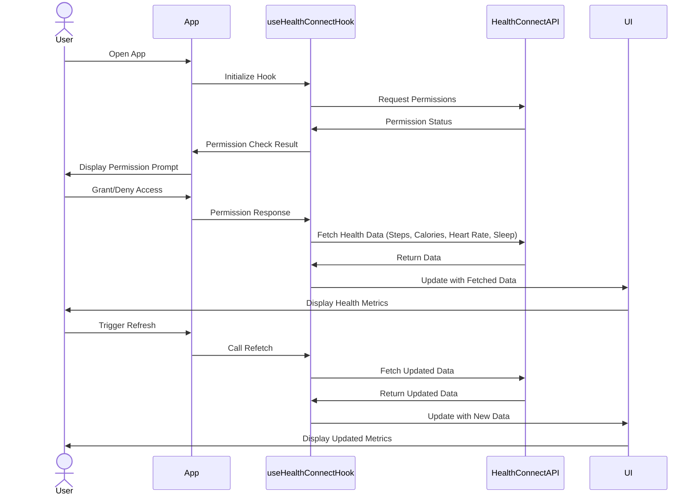

# 서버 IP 수정 파일

1. Health-Connect > android > app > src > main > res > xml > network_security_config.xml
2. Health-Connect > .env

# React Native Google Health Connect Integration with Expo 🚀


**A robust, TypeScript-based React Native Expo app demonstrating seamless integration with Google Health Connect using `react-native-health-connect`.**

This repository provides a complete guide and codebase for integrating Google Health Connect into a React Native Expo app. Fetch health data like steps, calories burned, heart rate, and sleep with ease, while handling permissions, errors, and best practices. Built with TypeScript for type safety, this project is perfect for developers building fitness or wellness apps in 2025! 🎉

For a detailed step-by-step tutorial, check out our Medium post.
**[Integrating Google Health Connect in React Native Expo Apps](https://medium.com/@haidermukhtar/integrating-google-health-connect-in-react-native-expo-apps-56e2477b7e17)**

> **Note**: Health Connect is Android-only. For iOS, consider `react-native-health` for Apple HealthKit integration. Always test on a physical Android device or emulator and comply with GDPR/HIPAA for user privacy..

## 🎯 Features

- Fetch **steps**, **calories burned**, **heart rate**, and **sleep data** from Google Health Connect.
- Custom React hook for streamlined data fetching and permission handling.
- Comprehensive error handling for permission denials and edge cases.
- Expo dev client for native module support.
- TypeScript for robust type safety.
- Modern, gradient-based UI with reusable components.

## 📸 Permission Request Flow


## 📱 Main Dashboard


## 🚀 Getting Started

### 1. Clone the Repository

```bash
git clone https://github.com/Haider-Mukhtar/ReactNative-Health-Connect.git
cd ReactNative-Health-Connect
```

### 2. Install Dependencies

```bash
npm install
```

### 3. Configure Android Permissions

Update `app.json` with the following configuration:

```bash
{
  "expo": {
    "plugins": [
      "expo-health-connect",
      [
        "expo-build-properties",
        {
          "android": {
            "compileSdkVersion": 35,
            "targetSdkVersion": 35,
            "minSdkVersion": 26,
            "buildToolsVersion": "35.0.0"
          }
        }
      ]
    ],
    "android": {
      "package": "com.yourcompany.healthconnectdemo",
      "permissions": [
        "android.permission.health.READ_STEPS",
        "android.permission.health.READ_ACTIVE_CALORIES_BURNED",
        "android.permission.health.READ_HEART_RATE",
        "android.permission.health.READ_SLEEP"
      ]
    }
  }
}
```

### 4. Prebuild the Project

Since this project uses native modules, run:

```bash
npx expo prebuild --platform android
```

### 5. Run the App

```bash
npx expo run:android
```

## 📂 Project Structure

```
├── app/
│   ├── _layout.tsx           # Main app layout
│   ├── index.tsx             # Main app screen
│── assets/
│── hooks/
│   │── useHealthConnect.ts   # Custom hook for Health Connect
├── app.json                  # Expo configuration
├── README.md                 # You're here!
```

## 📚 Use Cases

- **Fitness Tracker:** Auto-log steps and calories for gamified goals.
- **Sleep Analyzer:** Track sleep duration for wellness insights.
- **Health Monitor:** Alert on irregular heart rates.



## 🤝 Contributing

Contributions are welcome! 🙌 Fork the repo, create a branch, and submit a pull request. Check issues for tasks or report bugs.

## 📜 License

MIT License. See [LICENSE](https://github.com/Haider-Mukhtar/ReactNative-Health-Connect/blob/main/LICENSE) for details.

## 📬 Stay Connected

Want more React Native tutorials and tips?

- 🌐 Website: [haidermukhtar.vercel.app](https://haidermukhtar.vercel.app/)
- 💼 LinkedIn: [Haider Mukhtar](https://www.linkedin.com/in/haider-mukhtar/)

Happy coding! Build something amazing with Google Health Connect in 2025! 💻
